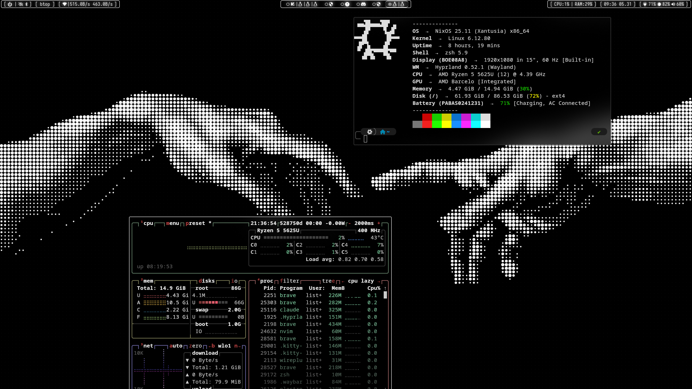
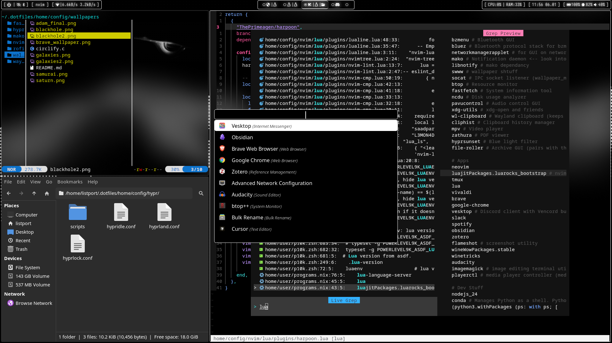
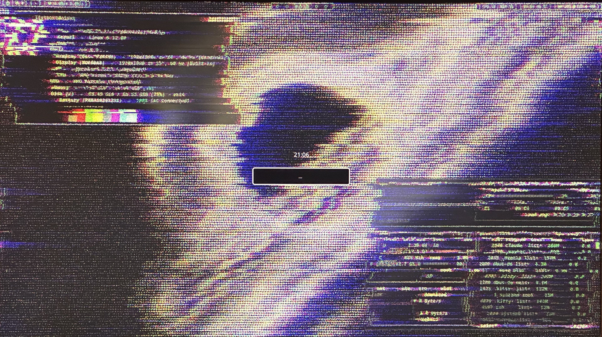
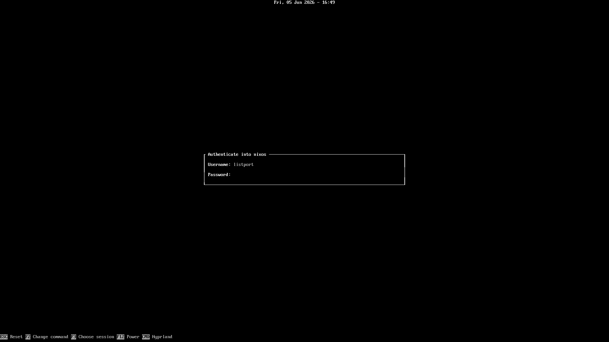

# My NixOS+Hyprland Dotfiles


My personal NixOS-flake configuration running Hyprland. Configs are managed by home-manager.

---

<table>
<tr>
<td align="center"><br><b>Main Desktop</b></td>
<td align="center"><br><b>Neovim, Yazi, Thunar, and Rofi</b></td>
</tr>
<tr>
<td align="center"><br><b>Lock Screen (Screenshots for Wallpaper)</b></td>
<td align="center"><br><b>TUI Greeter</b></td>
</tr>
</table>

---

## Components

| Component        | Name                        |
|------------------|-----------------------------|
| Distro           | NixOS 25.11                 |
| Shell            | Zsh + oh-my-zsh + p10k      |
| Display Server   | Wayland                     |
| WM / Compositor  | Hyprland                    |
| Bar              | Waybar                      |
| Notifications    | Mako                        |
| App Launcher     | Rofi                        |
| Terminal         | Kitty                       |
| Editor           | Neovim                      |
| File Manager     | Thunar                      |
| Browser          | Brave / Vivaldi             |
| Screenshots      | Flameshot                   |
| Wallpaper        | swww                        |
| Lock Screen      | Hyprlock                    |
| Idle Daemon      | Hypridle                    |
| Display Manager  | greetd + tuigreet           |
| Theme            | PureBlack GTK               |
| Icons            | Papirus-Dark                |
| Cursor           | Bibata-Modern-Ice           |
| Font             | Iosevka Nerd Font           |

---

## Repo Structure

```
.dotfiles/
├── flake.nix                   # Flake inputs & outputs (nixpkgs, home-manager, hyprland, nixos-hardware)
├── system/
│   ├── configuration.nix       # Core system config (networking, fonts, users, services)
│   ├── hardware-configuration.nix
│   └── modules/
│       ├── programs.nix        # Hyprland enable + xdg portals
│       ├── packages.nix        # System-level packages
│       ├── brave.nix           # Brave browser group policies (custom NixOS option)
│       └── greetd.nix          # Login manager (tuigreet -> Hyprland)
└── home/
    ├── default.nix             # Home-manager entry point
    ├── pkgs/
    │   └── pureblack-gtk-theme.nix   # Custom GTK theme derivation
    ├── user/
    │   ├── programs.nix        # User packages, GTK theme, git, kitty, waybar, flameshot
    │   ├── shell.nix           # Zsh config, p10k, oh-my-zsh, aliases, zoxide
    │   ├── config.nix          # Symlinks dotfiles into ~/.config/
    │   └── p10k.zsh            # Powerlevel10k prompt config
    └── config/
        ├── hypr/               # Hyprland, hyprlock, hypridle configs + scripts
        ├── waybar/             # Bar config + CSS
        ├── nvim/               # Neovim config (lazy.nvim)
        ├── rofi/               # App launcher theme
        ├── mako/               # Notification daemon config
        ├── fastfetch/          # System fetch config
        └── wallpapers/         # Wallpaper images
```

### System vs Home

Configuration is split into two layers that are rebuilt independently:

- **System** (`system/`) — NixOS modules, rebuilt with `rebuild`. Covers hardware, boot, networking, system services, fonts, and programs that need root.
- **Home** (`home/`) — Home Manager modules, rebuilt with `homeRebuild`. Covers user packages, dotfiles, shell, and desktop environment config.

---

## Keybindings

| Key                          | Action                              |
|------------------------------|-------------------------------------|
| `SUPER + Return`             | Open terminal (Kitty)               |
| `SUPER + SHIFT + Return`     | Floating dropdown terminal          |
| `SUPER + D`                  | App launcher (Rofi)                 |
| `SUPER + E`                  | File manager (Thunar)               |
| `SUPER + B`                  | Open browser                        |
| `SUPER + Q`                  | Kill active window                  |
| `SUPER + V`                  | Toggle floating                     |
| `SUPER + SHIFT + F`          | Fullscreen                          |
| `SUPER + G`                  | Toggle split (dwindle)              |
| `SUPER + M`                  | Exit Hyprland                       |
| `SUPER + Escape`             | Power menu                          |
| `CTRL + ALT + L`             | Lock screen                         |
| `SUPER + H/J/K/L`            | Move focus                          |
| `SUPER + SHIFT + H/J/K/L`    | Move window                         |
| `SUPER + Y/U/I/O/P`          | Switch to workspace 1–5             |
| `SUPER + 6/7/8/9/0`          | Switch to workspace 6–10            |
| `SUPER + SHIFT + Y…0`        | Move window to workspace            |
| `SUPER + [ / ]`              | Move to previous/next workspace     |
| `SUPER + = / -`              | Scale display up/down               |
| `SUPER + SHIFT + S`          | Screenshot (Flameshot)              |
| `SUPER + CTRL + ALT + B`     | Toggle Waybar                       |

---

## Zsh Aliases

| Alias          | Command                                                                 |
|----------------|-------------------------------------------------------------------------|
| `rebuild`      | `sudo nixos-rebuild switch --flake ~/.dotfiles/`                        |
| `homeRebuild`  | `home-manager switch --flake ~/.dotfiles/ -b backup`                   |
| `fullRebuild`  | Both of the above in sequence                                           |
| `fullClean`    | Collect garbage, delete old generations, update boot entries            |
| `ls`           | `eza --icons=always`                                                    |

---

## Hardware Notes

nixos-hardware modules in use (no model-specific module exists for this laptop):

- `common-cpu-amd` + `common-cpu-amd-pstate` — AMD microcode and P-state driver
- `common-pc-laptop` — TLP power management
- `common-pc-laptop-ssd` — periodic fstrim

> **Note:** `common-pc-laptop` sets the CPU governor to `powersave` by default, which causes noticeable slowness. This is overridden in `configuration.nix` with `schedutil`.
