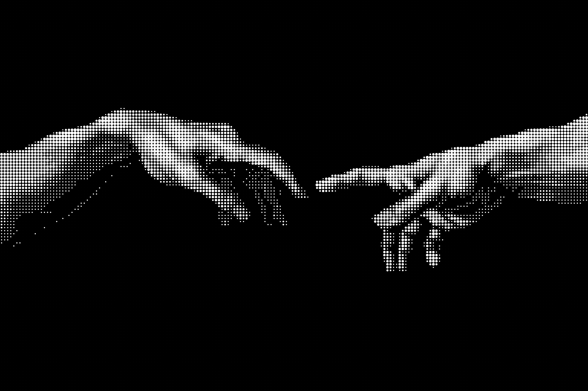
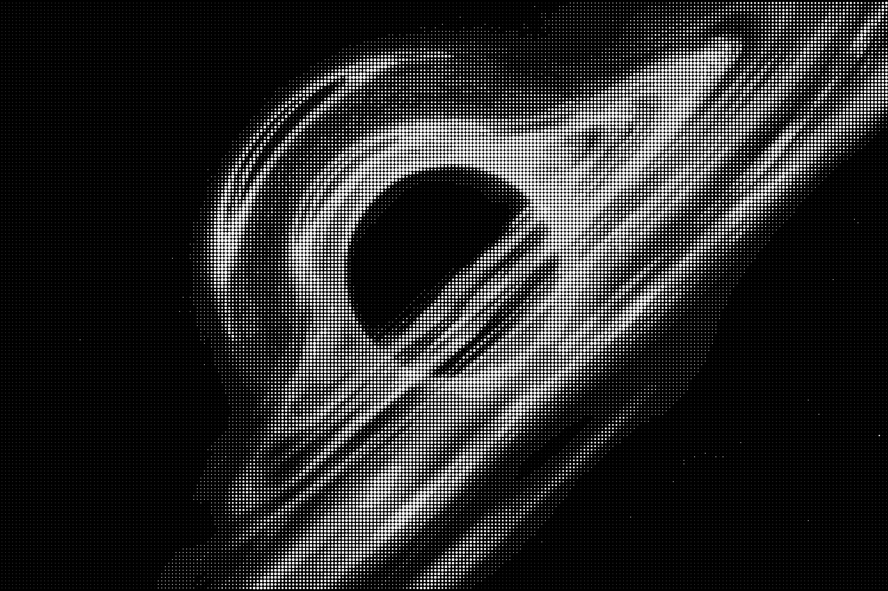
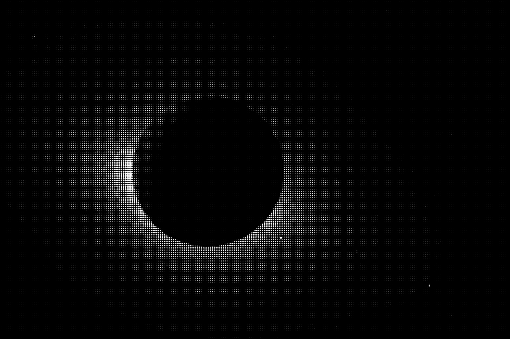
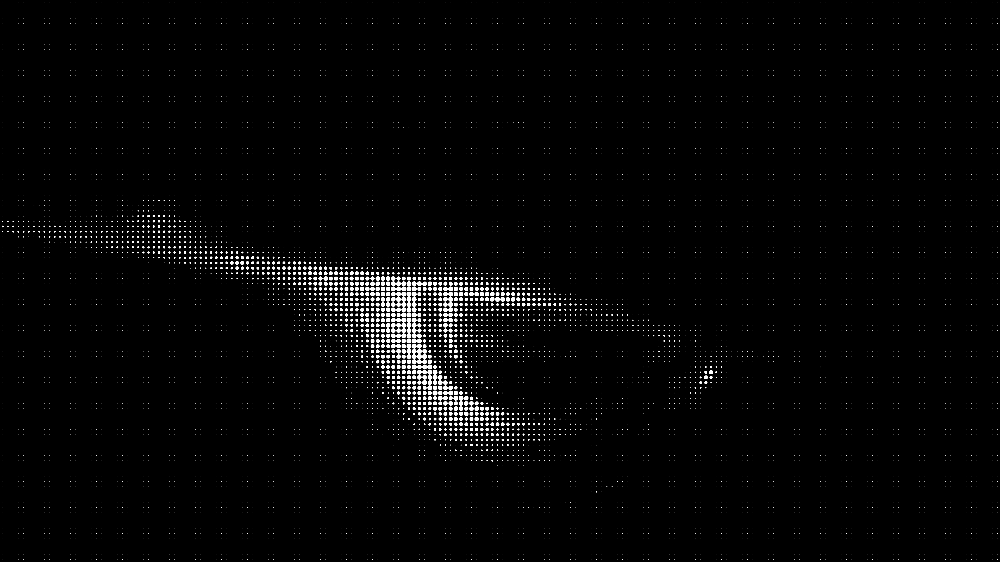

# Circlify

`circlify.c` converts any image into a halftone grid of anti-aliased white circles on a pure black background. Circle size at each position encodes the local brightness of the source image — bright areas become large circles, dark areas become small ones (or vice versa with `--invert`).

This makes it useful for generating wallpapers that stay consistent with the black/minimal palette of this setup even when the source image has color.

---

<table>
<tr>
<td align="center"><br><b>eDP-1</b> &mdash; adam_final</td>
<td align="center"><br><b>1st external</b> &mdash; blackhole</td>
</tr>
<tr>
<td align="center"><br><b>2nd external</b> &mdash; brave_wallpaper</td>
<td align="center"><br><b>3rd external</b> &mdash; blackhole2</td>
</tr>
</table>

Monitor slots are stable by Hyprland's internal monitor ID. `wallpaper_manager.sh` sets wallpapers on startup and re-runs automatically whenever a monitor is added or removed via the Hyprland IPC socket.

---

## Dependencies

`circlify.c` uses the [stb](https://github.com/nothings/stb) single-header libraries for image I/O. Download both into the same directory as the source file before compiling:

```bash
curl -O https://raw.githubusercontent.com/nothings/stb/master/stb_image.h
curl -O https://raw.githubusercontent.com/nothings/stb/master/stb_image_write.h
```

---

## Compiling

```bash
gcc circlify.c -o circlify -lm
```

---

## Usage

```
./circlify <image> [--normalize] [--invert] [--upscale <n>]
```

Output is always written to `output.png` in the current directory.

### Options

| Flag | Description |
|---|---|
| `--normalize` | Stretches the contrast of the source image to the full 0–255 range before processing. Useful for low-contrast or washed-out inputs where the circle sizes would otherwise cluster in a narrow band. |
| `--invert` | Inverts brightness mapping — bright areas produce small circles, dark areas produce large ones. Use this when the source image has a light background you want to suppress. |
| `--upscale <n>` | Multiplies the output resolution by `n`. The default output is the same pixel dimensions as the input. At `--upscale 2` everything doubles, giving cleaner circle edges at large display sizes. Recommended: `2` or `3` for wallpaper use. |

---

## How It Works

1. The source image is converted to grayscale using standard luminance weights (`0.299 R + 0.587 G + 0.114 B`).
2. The image is divided into a grid of 5×5 pixel cells. Each cell's average brightness is computed.
3. Brightness is mapped to one of 8 circle-size buckets using a square-root curve, which gives perceptually even steps between sizes.
4. An anti-aliased white circle is drawn into each cell on a black canvas, sized proportionally to its bucket.
5. The result is written to `output.png`.

---

## Examples

Basic conversion:
```bash
./circlify galaxies.png
```

Better contrast on a flat image:
```bash
./circlify samurai.png --normalize
```

Inverted mapping (light source image):
```bash
./circlify photo.jpg --invert --normalize
```

High-resolution output for a 4K display:
```bash
./circlify adam_final.png --upscale 3
```

Full pipeline — process, upscale, move to wallpapers:
```bash
./circlify galaxies.png --normalize --upscale 2 && mv output.png galaxies_circles.png
```

